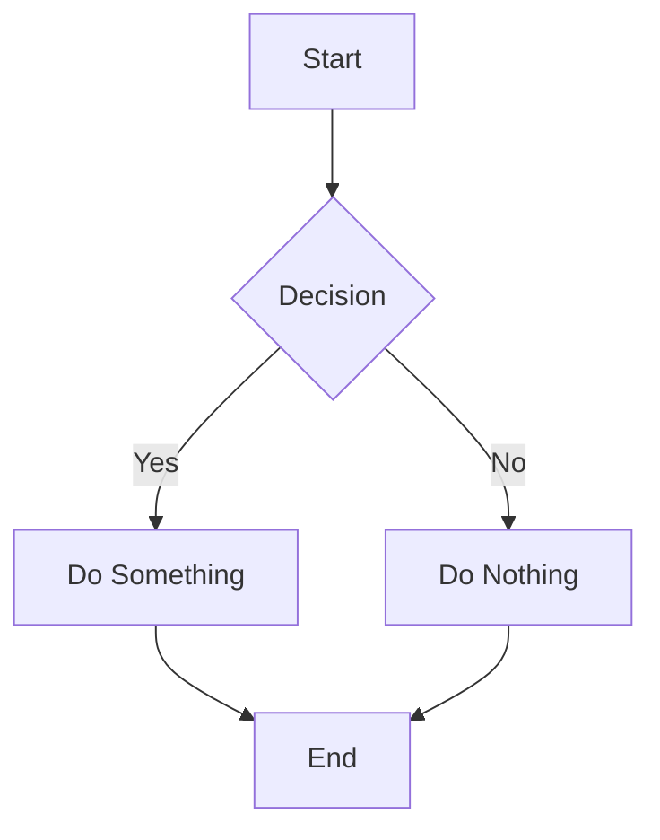

This site is published from https://github.com/flowershow/demo using [Flowershow](https://flowershow.app) - an elegant solution for publishing your Obsidian vaults and Markdown content directly from GitHub repositories.

## 🎯 What's Inside?

This demo showcases various Flowershow features and configuration options:

- 📝 **Rich Markdown Support**
  - Tables, code blocks, and diagrams
  - Math equations and LaTeX
  - Callouts and blockquotes
  - Obsidian wiki-links
  - And much more!

- 🎨 **Customization Options**
  - Comments
  - Navigation setup
  - Custom domain

## 📚 Markdown Syntax

### Text Formatting

**Bold text** and *italic text* and ***bold italic text***

~~Strikethrough text~~

`Inline code`

==Highlighted text==

### Lists

Unordered list:
* Item 1
* Item 2
  * Nested item 2.1
  * Nested item 2.2
* Item 3

Ordered list:
1. First item
2. Second item
   1. Nested item 2.1
   2. Nested item 2.2
3. Third item

### Task Lists

- [x] Completed task
- [ ] Incomplete task
- [ ] Another task
  - [x] Nested completed task
  - [ ] Nested incomplete task

### Code Blocks

Inline code: `const greeting = "Hello, World!";`

```javascript
// JavaScript example
function calculateSum(a, b) {
  return a + b;
}

const result = calculateSum(5, 3);
console.log(result); // Output: 8
```

```python
# Python example
def greet(name):
    return f"Hello, {name}!"

print(greet("Flowershow"))
```

### Tables

| Book Type | Average Length | Reading Time |
|-----------|---------------|--------------|
| Novel | 300 pages | 5 hours |
| Magazine | 50 pages | 1 hour |
| Comic Book | 30 pages | 30 minutes |
| Cookbook | 200 pages | 2 hours |

### Blockquotes

> Single line quote

> Multi-line quote
> with multiple paragraphs
> > Nested quote
> > > Deeper nested quote

### Links and Images

(`[Visit Flowershow Website](https://flowershow.app)`) [Visit Flowershow Website](https://flowershow.app)

(``) 

### Obsidian Wiki-links

Flowershow supports Obsidian-style wiki-links. For example, this links to our example blog post: (`[[abc]]`) [[abc]]

You can also use the full path: (`[[blog/abc]]`) [[blog/abc]] 

And use Obsidian-style image embedding: (`![[lotus.png]]`) ![[lotus.png]] 

### Math Equations

TBD

### Diagrams



### Callouts

> [!NOTE]
> This is a note callout

> [!WARNING]
> This is a warning callout

> [!TIP]
> This is a tip callout

> [!IMPORTANT]
> This is an important callout

### Footnotes

Here's a sentence with a footnote[^1].

[^1]: This is the footnote content.

### Horizontal Rules

---
***
___


## ⚙️ Customization Options

For detailed information about all customization options, visit [Flowershow Documentation](https://flowershow.app/docs).

### Hero

The hero component at the top of this page is set using the `hero` frontmatter property. You can set it's title, description, image and two action buttons.

### Comments

The comments section you can see at the bottom of this page has been enabled through the Flowershow Cloud dashboard. This feature allows your readers to engage with your content and provide feedback directly on your pages.

### Navigation

The site's navigation elements including the logo, title ("My Digital Garden"), links (About), and social media links (GitHub, Twitter) have been configured using the [`config.json`](https://github.com/flowershow/demo/blob/main/config.json) file. This configuration provides a clean way to customize your site's header without modifying the source code.

### Custom Domain

Looking at the URL of this site, you'll notice it's available at a custom domain instead of the default Flowershow Cloud URL pattern (`/@username/sitename`). This is another customization option available through the Flowershow Cloud dashboard, allowing you to use your own domain name for a more professional appearance.


## 🤝 Contributing

Have a suggestion? Feel free to:
1. Open an issue
2. Submit a pull request
3. Start a discussion

---

*Built with 💖 using [Flowershow](https://flowershow.app)*
